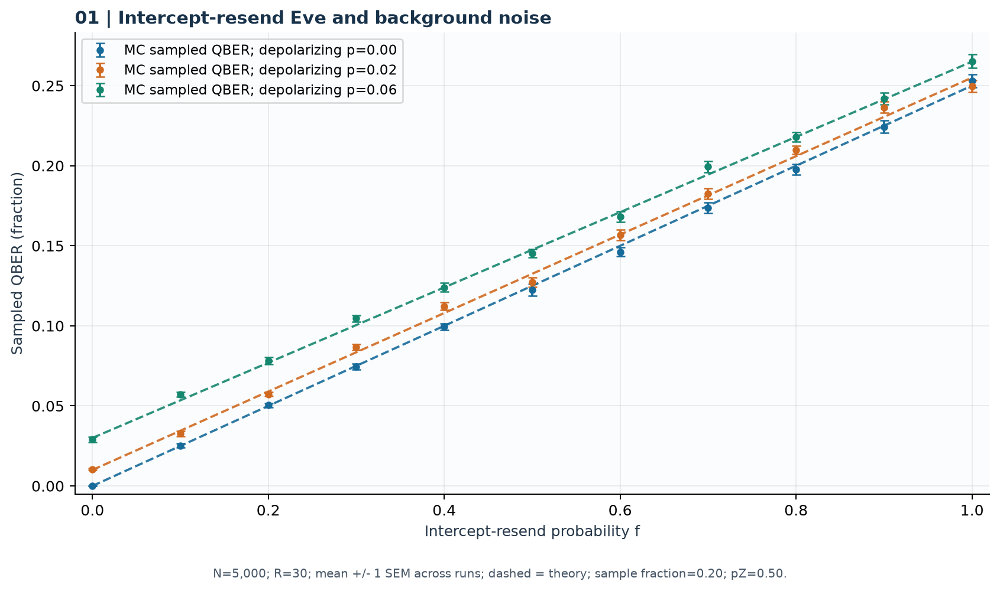
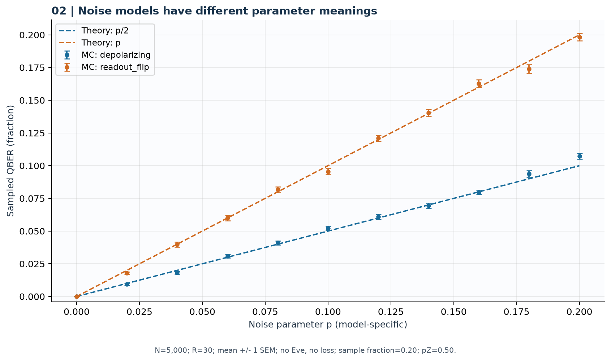
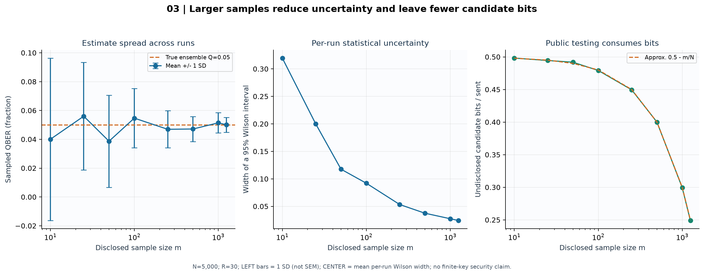
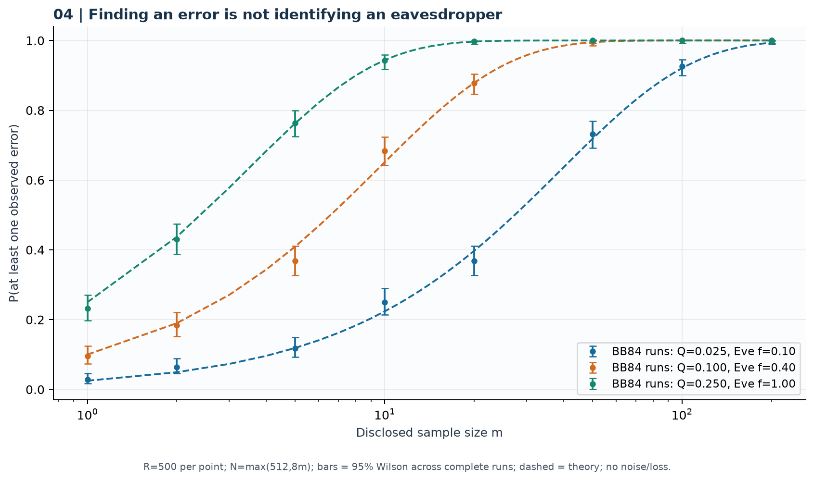
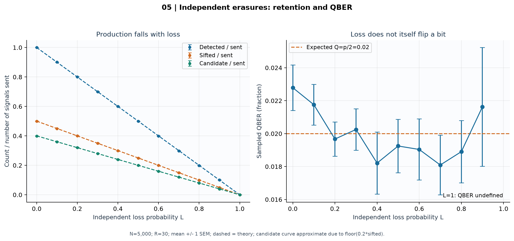
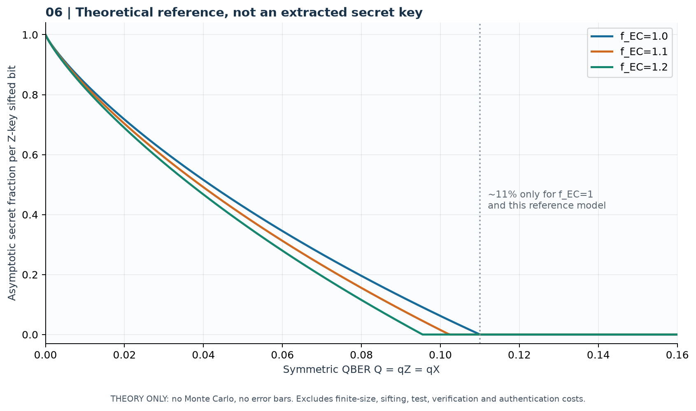

# Kết quả mô phỏng BB84

Preset **quick**, N=5000, repetitions=30, seed=84. Thí nghiệm xác suất thấy lỗi dùng cỡ khối/số lần lặp riêng theo metadata.

Mô hình dùng qubit lý tưởng, Eve chặn–đo–gửi lại với cơ sở đều và mất tín hiệu độc lập. QBER toàn bộ là thông tin chẩn đoán của simulator; Alice/Bob chỉ công bố mẫu. Khoảng Wilson minh họa bất định nhị thức, không phải chứng minh an toàn khóa hữu hạn. Bit ứng viên còn lại chưa trải qua xác thực, sửa lỗi, xác minh và khuếch đại riêng tư. QBER thấp không chứng minh không có Eve; thấy lỗi không xác định tác nhân gây lỗi.

## 1. QBER theo tỷ lệ Eve

Eve chặn–đo–gửi lại với ba mức nhiễu depolarizing.



- Eve chặn toàn bộ, không nhiễu: QBER mẫu trung bình 25.2907%; kỳ vọng 25%.
- Sai lệch tuyệt đối lớn nhất giữa trung bình mẫu và lý thuyết trên lưới: 0.6014 điểm phần trăm.
- Nhiễu và tấn công kết hợp theo e+c−2ec; QBER không xác định danh tính tác nhân gây lỗi.

Ý nghĩa thống kê: N=5,000; R=30; mean +/- 1 SEM across runs; dashed = theory; sample fraction=0.20; pZ=0.50.

[CSV từng lần chạy](data/01_eve_sweep_raw.csv) · [CSV tổng hợp / lý thuyết](data/01_eve_sweep_summary.csv) · [Hình PDF](figures/01_eve_sweep.pdf)

## 2. QBER theo mô hình nhiễu

Phân biệt depolarizing rho → (1−p)rho+pI/2 với lật bit đầu ra Bob.



- Tại p=0.20: depolarizing cho QBER mẫu 10.730%, readout_flip 19.834%.
- Lý thuyết tương ứng là p/2 và p. Không dùng cùng p để tuyên bố hai kênh có cùng mức lỗi.

Ý nghĩa thống kê: N=5,000; R=30; mean +/- 1 SEM; no Eve, no loss; sample fraction=0.20; pZ=0.50.

[CSV từng lần chạy](data/02_noise_sweep_raw.csv) · [CSV tổng hợp / lý thuyết](data/02_noise_sweep_summary.csv) · [Hình PDF](figures/02_noise_sweep.pdf)

## 3. Bất định QBER và chi phí lấy mẫu

Lấy mẫu công khai từ đầu ra BB84; Eve f=0.20, không nhiễu/mất, Q kỳ vọng 0.05.



- Khi m tăng từ 10 lên 1250, độ rộng Wilson trung bình đổi từ 0.3196 thành 0.0243.
- Ở m=1250, phần ứng viên chưa công bố trung bình bằng 24.90% số tín hiệu phát.
- Độ lệch chuẩn giữa các lần chạy khác với sai số chuẩn của trung bình; Wilson 95% không phải bảo đảm finite-key QKD.

Ý nghĩa thống kê: N=5,000; R=30; LEFT bars = 1 SD (not SEM); CENTER = mean per-run Wilson width; no finite-key security claim.

[CSV từng lần chạy](data/03_sample_uncertainty_raw.csv) · [CSV tổng hợp / lý thuyết](data/03_sample_uncertainty_summary.csv) · [Hình PDF](figures/03_sample_uncertainty.pdf)

## 4. Xác suất thấy ít nhất một lỗi

Mỗi điểm chạy giao thức BB84 nhiều lần; so sánh với 1−(1−Q)^m trong ensemble i.i.d.



- Q=2.5%, m=20: xác suất thấy lỗi mô phỏng 36.80%; lý thuyết 39.73%.
- Có 0 lần không đủ cỡ mẫu; các lần đó được lưu dữ liệu và loại khỏi mẫu số ước lượng xác suất.
- Đây là xác suất tìm thấy lỗi, không phải xác suất chứng minh Eve hiện diện; mẫu nhỏ có thể bỏ sót lỗi.

Ý nghĩa thống kê: R=500 per point; N=max(512,8m); bars = 95% Wilson across complete runs; dashed = theory; no noise/loss.

[CSV từng lần chạy](data/04_error_detection_raw.csv) · [CSV tổng hợp / lý thuyết](data/04_error_detection_summary.csv) · [Hình PDF](figures/04_error_detection.pdf)

## 5. Mất tín hiệu và tỷ lệ giữ lại

Mất tín hiệu độc lập; nhiễu nền depolarizing p=0.04 giữ cố định; không Eve.



- Tỷ lệ sifted/phát kỳ vọng bằng (1−L)/2; phần ứng viên còn lại xấp xỉ 0.4(1−L).
- Nhiễu nền cho QBER kỳ vọng 2% dù xác suất mất thay đổi; ít tín hiệu sống sót làm ước lượng dao động hơn.
- Tại L=1 không có bit được phát hiện; QBER là không xác định, không được thay bằng 0.

Ý nghĩa thống kê: N=5,000; R=30; mean +/- 1 SEM; dashed = theory; candidate curve approximate due to floor(0.2*sifted).

[CSV từng lần chạy](data/05_loss_retention_raw.csv) · [CSV tổng hợp / lý thuyết](data/05_loss_retention_summary.csv) · [Hình PDF](figures/05_loss_retention.pdf)

## 6. Tỷ lệ khóa tiệm cận tham chiếu

r∞ = max(0, 1−h2(Q)−fEC h2(Q)); mô hình lý tưởng, sai số bit/pha đối xứng.



- Khi hiệu suất sửa lỗi kém hơn (fEC tăng), phần khóa tiệm cận tham chiếu giảm.
- Mốc xấp xỉ 11% chỉ thuộc trường hợp fEC=1 với giả định đang nêu; không là ngưỡng chứng nhận phổ quát.
- Chương trình chưa sửa lỗi/khuếch đại riêng tư; các đường này không phải khóa bí mật thực tế được sinh ra.

Ý nghĩa thống kê: THEORY ONLY: no Monte Carlo, no error bars. Excludes finite-size, sifting, test, verification and authentication costs.

[CSV tổng hợp / lý thuyết](data/06_secret_fraction_theory.csv) · [Hình PDF](figures/06_secret_fraction.pdf)

## Tái lập

```text
python -m bb84 experiments --preset quick --output results-reproduced --seed 84 --signals 5000 --repetitions 30
```

Xem metadata.json để biết phiên bản, cấu hình và SHA-256 mã nguồn. Seed từng lần chạy nằm trong CSV thô.
